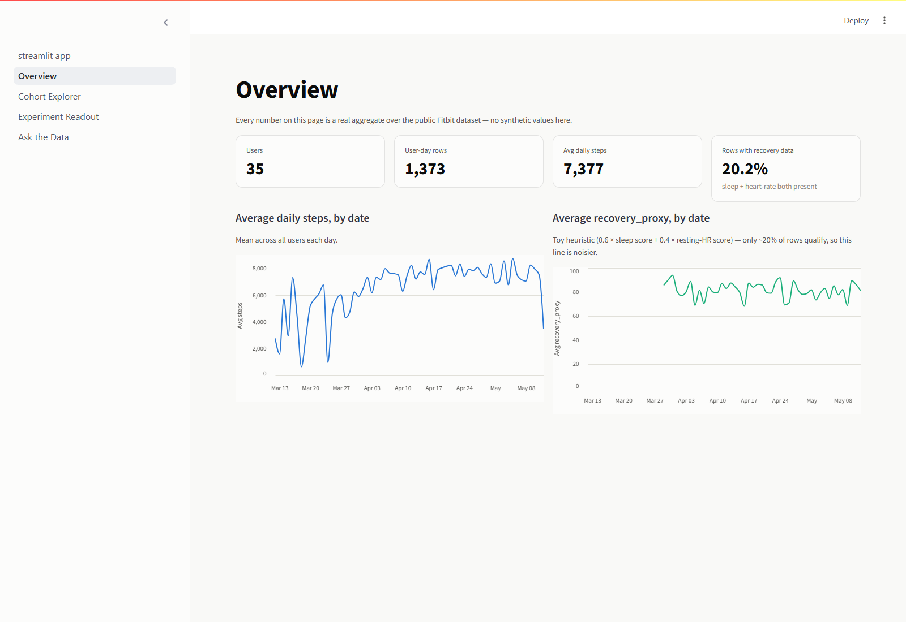
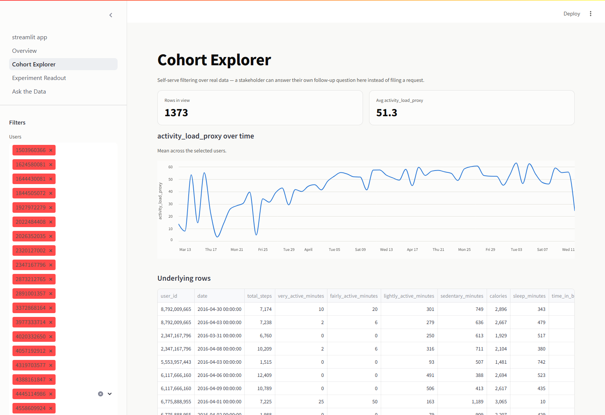
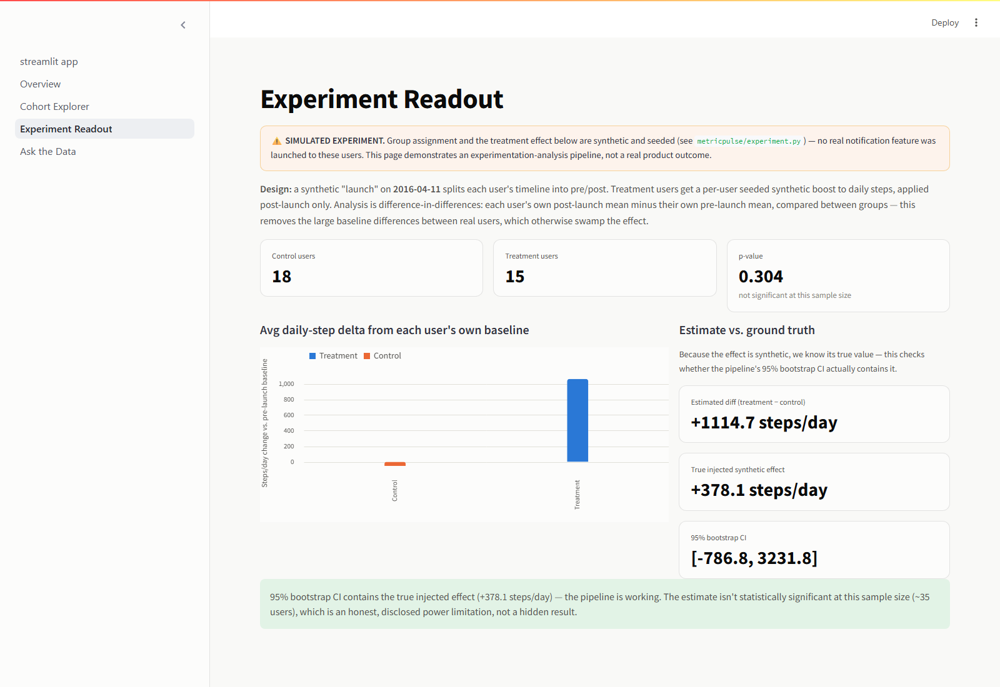
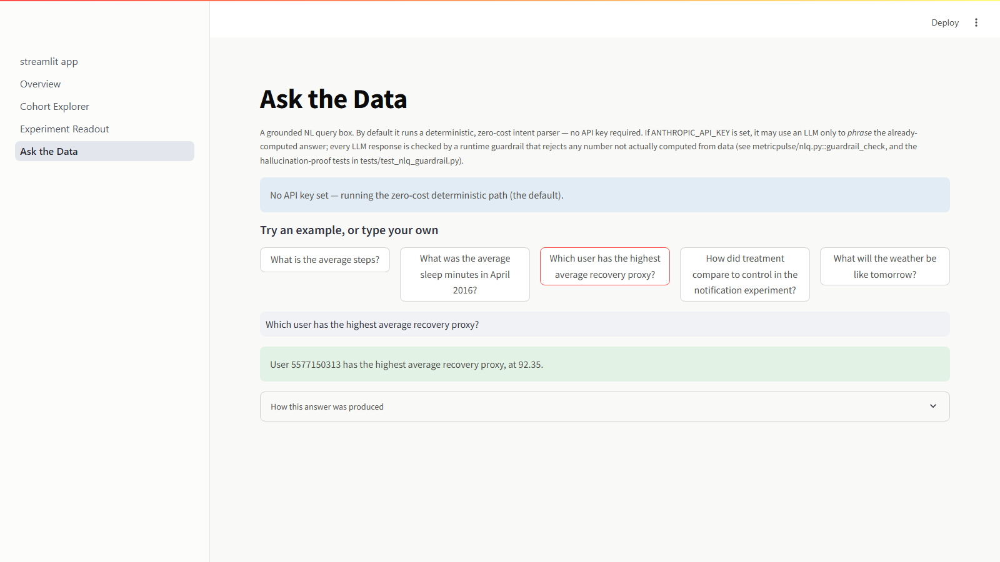

# MetricPulse

A small, self-serve wearable-analytics demo: a dbt-modeled KPI mart on a **real** public wearable dataset, a self-serve Streamlit app, an experimentation-analysis pipeline validated against a **clearly-labeled synthetic** effect, and a natural-language query layer that is **guardrail-tested to never hallucinate a number**.

This is a solo portfolio project. It is not affiliated with, built for, or modeled on any specific company's product — see [Honest scope](#honest-scope) below for exactly what's real and what's simulated.

## What it demonstrates

- **KPI definition & measurement frameworks on real data.** A dbt project turns raw device-export CSVs into one clean, tested KPI table (`mart_daily_user_metrics`), including two documented toy heuristics (`recovery_proxy`, `activity_load_proxy`) built to be explainable, not to claim clinical validity.
- **Self-serve reporting.** A Streamlit app lets a non-technical stakeholder filter by user/date and explore KPIs without writing SQL.
- **Experimentation, end-to-end, honestly framed.** A synthetic, seeded A/B assignment + treatment effect is layered on top of real behavioral baselines, analyzed with a difference-in-differences design, and reported with a bootstrap confidence interval — including the case where the effect is *not* statistically significant at this sample size, because that's what the numbers actually show.
- **Grounded GenAI.** A natural-language query box answers strictly from numbers computed by pandas/DuckDB. An optional LLM phrasing step is guardrail-checked at runtime, and a test suite proves the guardrail actually rejects a hallucinated number, not just that the happy path works.
- **AI-tool use held to a normal engineering bar.** Every claim below is checkable by running the code in this repo.

## Screenshots

| Overview — real-data KPIs & trends | Cohort Explorer — self-serve filtering |
|---|---|
|  |  |

| Experiment Readout — labeled synthetic A/B analysis | Ask the Data — grounded NL query |
|---|---|
|  |  |

## Architecture

```
Zenodo (real, CC-BY-4.0, no auth)
  └─ scripts/download_data.py   -> data/raw/*.csv          (small files, committed)
  └─ scripts/aggregate_heartrate.py -> data/processed/daily_heartrate_agg.csv
                                        (real, derived; raw seconds-level files
                                         too large to commit -> data/raw_large/, gitignored)
       │
       ▼
dbt_project/ (dbt-duckdb)
  models/staging/  stg_daily_activity, stg_daily_sleep, stg_daily_heartrate
  models/marts/    mart_daily_user_metrics   <-- single source of truth
       │
       ▼
metricpulse/ (Python package)
  db.py         read access to the mart
  metrics.py    the ONE aggregate-computation path (app + NLQ both call this)
  experiment.py SIMULATED experiment: seeded assignment -> seeded synthetic
                effect -> difference-in-differences readout
  nlq.py        grounded NL query engine + runtime guardrail
       │
       ▼
app/ (Streamlit)         tests/ (pytest)
  Overview                 test_nlq_grounding.py  -- numbers match independent recompute
  Cohort Explorer           test_nlq_guardrail.py -- proves hallucinated numbers get rejected
  Experiment Readout        test_experiment.py    -- seeded determinism, no mutation of real
  Ask the Data                                        data, CI recovers the known effect
```

## Key design decisions and why

- **dbt-duckdb instead of Snowflake/dbt.** The JD-style stack this maps to is Snowflake + dbt + ELT. I don't have a Snowflake account to demo against, so I used dbt-duckdb — the same modeling patterns (`source()`, `ref()`, staging → marts, schema tests, singular tests), running entirely locally with zero cloud cost. Swapping the DuckDB adapter for Snowflake would require no changes to the SQL models.
- **Sleep computed from minute-level records, not `sleepDay_merged.csv`.** The `sleepDay` export only exists for the second of the two source windows; rebuilding daily sleep minutes from `minuteSleep_merged` (value=1 → asleep) keeps both windows comparable.
- **Heart-rate aggregation happens outside dbt.** The raw second-level heart-rate CSVs are 40–90MB each — too large to commit to git and impractical as dbt seeds. `scripts/aggregate_heartrate.py` reduces them to one small, real, derived daily table before dbt ever sees them; the reduction script itself is committed and reproducible.
- **A real, disclosed data-quality bug, not papered over.** The two Zenodo export windows overlap on 2016-04-12 — most users have a row for that date in *both* exports, sometimes with slightly different values (a device-side boundary artifact). `stg_daily_activity` resolves this deterministically (keeps the second window's row) rather than silently deduplicating or averaging; there's a dbt test (`assert_unique_user_date`) that would fail loudly if this regressed.
- **KPI proxies are named `*_proxy` and documented as toy heuristics.** `recovery_proxy` = 0.6 × sleep-score + 0.4 × resting-HR-proxy score, with arbitrary weights, computed in `mart_daily_user_metrics.sql`. This dataset has no HRV, respiratory rate, or skin temperature — the inputs a real recovery algorithm would use — so the formula is explicitly presented as illustrative, not as a validated model.
- **Difference-in-differences, not a naive two-group comparison, for the experiment readout.** An earlier version compared raw post-launch step counts between treatment and control and got a wildly wrong answer — real users differ enormously in baseline daily steps (some walk 3–4x more than others), which swamped a ~400-step synthetic effect. Differencing each user's post-launch mean against their *own* pre-launch mean removes that confound. This is also just the statistically correct design for this kind of experiment.
- **The experiment result is reported honestly, including non-significance.** With ~35 users split into two groups, the 95% bootstrap CI is wide and the effect is not statistically significant — the CI does contain the true injected effect, but p ≈ 0.3. The app and NLQ engine report this as-is rather than hiding it or re-running with a bigger synthetic effect until it "looks good."
- **Guardrail runs at runtime, not just in tests.** `nlq.guardrail_check` is called on every LLM-phrased response, not only inside the test suite — a hallucinated number is rejected in production, not just in CI.
- **Zero required paid dependencies.** `anthropic`/`openai` are not in `requirements.txt`. The LLM phrasing path only imports them lazily, inside a try/except, only if an API key is present.
- **A small, deliberate visual system instead of default widget styling.** `app/_style.py` defines a fixed categorical palette (blue = primary/treatment, orange = control, aqua = secondary metric), reused across every stat tile and Altair chart, so the app reads as one system rather than default Streamlit chrome. Charts use Altair (already a Streamlit dependency) instead of `st.line_chart`/`st.bar_chart` specifically to get real hover tooltips, muted gridlines/axes, and a legend whenever two series are compared — none of which the built-in chart wrappers expose.

## Running it

```bash
python -m venv .venv && .venv/Scripts/activate   # or source .venv/bin/activate on macOS/Linux
pip install -r requirements.txt

python scripts/download_data.py        # real data from Zenodo, MD5-verified
python scripts/aggregate_heartrate.py  # real, derived heart-rate daily aggregate

cd dbt_project && dbt build --profiles-dir . && cd ..

pytest -v                              # 19 tests, all passing as of this commit
streamlit run app/streamlit_app.py
```

To try the optional LLM-phrasing upgrade, set `ANTHROPIC_API_KEY` in your environment before launching the app. Without it, everything runs identically on the deterministic, zero-cost path — that's the default and the path the test suite exercises. The `anthropic` package itself is free to install; it's only imported if a key is present, and each upgraded call is a single short rephrase of an already-computed sentence run at `effort: "low"` on Claude Sonnet 5 (list price ~$2-3 / MTok input, ~$10-15 / MTok output as of Aug 2026) — real but negligible cost for a demo, never required.

## Honest scope

**Real:**
- All daily activity, sleep, and heart-rate figures in `data/raw/`, `data/processed/`, and the resulting `mart_daily_user_metrics` come from the "Crowd-sourced Fitbit datasets 03.12.2016–05.12.2016" (Furberg, Brinton, Keating, Ortiz — RTI International), published on Zenodo under CC-BY-4.0: https://zenodo.org/records/53894. No login was required; both zip files were MD5-verified against the published checksums before use.
- As actually loaded: **35 distinct user IDs**, **1,373 user-day rows**, spanning **2016-03-12 to 2016-05-12**. (The dataset is commonly cited as "30 Fitbit users" — the two export windows include a few different device IDs, which is why the merged total is 35, not 30. Documented here rather than just repeating the commonly-cited 30.)
- Only **15 of the 35 users** have any heart-rate data (device-dependent) — 34.2% of rows have a `resting_hr_proxy`, 46.1% have sleep data, and 20.2% have both (and therefore a `recovery_proxy`).

**Synthetic (seeded, documented, never blended silently into the real columns):**
- The entire notification-nudge "experiment" in `metricpulse/experiment.py` and the Experiment Readout page: group assignment (`assign_groups`) and the per-user treatment effect (`apply_synthetic_nudge_effect`) are both generated from fixed, documented seeds. The real `total_steps` column is never overwritten — the synthetic effect lives only in a separate `total_steps_with_synthetic_nudge` column.
- Because the injected effect is synthetic, its true value is known; the readout reports that true value alongside the pipeline's estimate specifically to show whether the analysis can recover a known effect — this is a pipeline-validation check, not a real-world result, and it's labeled as such everywhere it's shown (module docstring, app banner, README).

**Toy heuristics (real inputs, illustrative formula):**
- `sleep_score_proxy`, `activity_load_proxy`, and `recovery_proxy` in `mart_daily_user_metrics.sql` use arbitrary, documented weights chosen to produce a plausible 0–100 score for this demo. They are explicitly not validated against any physiological outcome, and the dataset lacks the inputs (HRV, respiratory rate, skin temperature) a real recovery algorithm would use.

**Limitations:**
- Small dataset (35 users, ~2 months, 2016) — not representative of a modern wearable's scale or sensor set.
- The experiment-detection power analysis above is honest about this: a ~400-step synthetic effect is not reliably distinguishable from noise at n≈35, and the readout says so rather than manufacturing significance.
- The NL-query engine supports a fixed, documented set of intents (average-metric-with-optional-date-filter, dataset coverage, top/bottom user by metric, experiment comparison). Anything outside that set gets an explicit refusal, by design — see `tests/test_nlq_grounding.py::test_unsupported_question_refuses_instead_of_guessing`.
